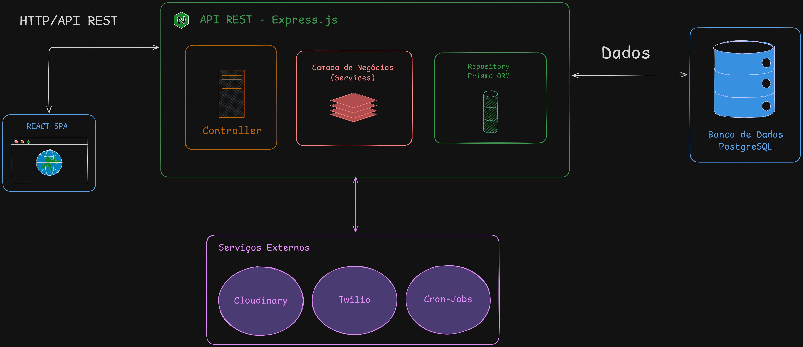

# 💈 ArtBarber - Sistema de Gestão para Barbearias

Sistema web completo para gerenciamento de barbearias, oferecendo agendamento online, controle de serviços, gestão de profissionais e notificações automáticas via WhatsApp.

---

## 📖 Sobre o Projeto

**ArtBarber** é uma solução moderna e completa para digitalizar a gestão de barbearias, facilitando o agendamento de serviços, a organização da agenda dos profissionais e a comunicação com os clientes. O sistema oferece três perfis distintos de acesso (Cliente, Barbeiro e Administrador), cada um com funcionalidades específicas para suas necessidades.

### 🎯 Principais Objetivos

- **Facilitar** o agendamento de serviços para clientes
- **Otimizar** a gestão de agenda dos barbeiros
- **Automatizar** lembretes e notificações
- **Centralizar** informações de serviços e profissionais
- **Reduzir** faltas e cancelamentos de última hora

---

## ✨ Funcionalidades

### 👤 Para Clientes
- ✅ Agendamento online de serviços
- ✅ Visualização de horários disponíveis em tempo real
- ✅ Seleção visual de barbeiro preferido
- ✅ Histórico completo de agendamentos
- ✅ Cancelamento de agendamentos futuros
- ✅ Notificações automáticas via WhatsApp
- ✅ Interface responsiva (mobile-first)

### ✂️ Para Barbeiros
- ✅ Dashboard com estatísticas do dia
- ✅ Visualização da agenda completa
- ✅ Criação de agendamentos manuais (presenciais)
- ✅ Atualização de status dos atendimentos
- ✅ Busca rápida por nome de cliente
- ✅ Controle de receita diária


### 🔧 Para Administradores
- ✅ Gestão completa de barbeiros (CRUD)
- ✅ Upload e gerenciamento de fotos dos profissionais
- ✅ Gestão de serviços e preços
- ✅ Controle de status de serviços (Ativo/Inativo)


### 📱 Sistema de Notificações
- ✅ Lembretes automáticos 15 minutos antes do agendamento
- ✅ Mensagens personalizadas via WhatsApp
- ✅ Rastreamento de entrega de mensagens
- ✅ Integração com Twilio WhatsApp Business API

---

## 🏗️ Arquitetura do Sistema

### Visão Geral

O **ArtBarber** foi desenvolvido seguindo uma arquitetura **cliente-servidor**  com separação clara entre frontend e backend, separando a aplicação em diferentes camadas.




### Padrões Arquiteturais Utilizados

#### 1. **Arquitetura em Camadas (Layered Architecture)**
Separação clara de responsabilidades:
- **Presentation Layer**: Componentes React e páginas
- **API Layer**: Controllers e rotas Express
- **Business Logic Layer**: Services com regras de negócio
- **Data Access Layer**: Repositories com Prisma ORM
- **Database Layer**: PostgreSQL

#### 2. **Repository Pattern**
Abstração do acesso aos dados, facilitando testes e manutenção:
```
Controller → Service → Repository → Database
```

#### 3. **Dependency Injection**
Serviços recebem dependências via construtor, facilitando testes unitários.

#### 4. **API RESTful**
Endpoints seguem convenções REST:
- **GET**: Leitura de recursos
- **POST**: Criação de recursos
- **PUT/PATCH**: Atualização de recursos
- **DELETE**: Remoção de recursos

#### 5. **Role-Based Access Control (RBAC)**
Sistema de permissões baseado em papéis (CLIENT, BARBER, ADMIN).

---

## 🛠️ Tecnologias Utilizadas

### Frontend
| Tecnologia | Versão | Propósito |
|------------|--------|-----------|
| **React** | 19.1.1 | Framework UI principal |
| **TypeScript** | 5.8.3 | Tipagem estática e segurança |
| **Vite** | 7.1.7 | Build tool e dev server |
| **React Router** | 7.9.5 | Roteamento client-side |
| **Tailwind CSS** | 4.1.14 | Framework CSS utility-first |
| **Shadcn** | - | Componentes acessíveis |
| **Axios** | 1.12.2 | Cliente HTTP |
| **React Hook Form** | 7.63.0 | Gerenciamento de formulários |
| **Zod** | 4.1.11 | Validação de schemas |
| **date-fns** | 4.1.0 | Manipulação de datas |

### Backend
| Tecnologia | Versão | Propósito |
|------------|--------|-----------|
| **Node.js** | 20+ | Runtime JavaScript |
| **TypeScript** | 5.8.3 | Tipagem estática |
| **Express.js** | 4.21.2 | Framework web |
| **Prisma** | 6.4.0 | ORM e migrations |
| **PostgreSQL** | 16 | Banco de dados relacional |
| **JWT** | 9.0.2 | Autenticação stateless |
| **Bcrypt** | 5.1.1 | Hash de senhas |
| **Zod** | 4.1.11 | Validação de dados |
| **Multer** | 1.4.5 | Upload de arquivos |
| **Node-cron** | 3.0.3 | Agendador de tarefas |
| **Twilio** | 5.3.5 | API WhatsApp |
| **Cloudinary** | 2.5.1 | Armazenamento de imagens |

### Infraestrutura & DevOps
| Tecnologia | Propósito |
|------------|-----------|
| **Docker** | Containerização do PostgreSQL |
| **Docker Compose** | Orquestração de containers |
| **Git** | Controle de versão |
| **ESLint** | Linting de código |
| **Prettier** | Formatação de código |

---

## 🚀 Como Funciona

### Fluxo de Agendamento (Cliente)

```
1. Cliente acessa o sistema
   ↓
2. Faz login ou se cadastra
   ↓
3. Seleciona um serviço (ex: Corte de Cabelo - R$ 35)
   ↓
4. Escolhe um barbeiro (visualiza foto e nome)
   ↓
5. Seleciona data (próximos 7 dias úteis)
   ↓
6. Sistema busca horários disponíveis em tempo real
   ↓
7. Cliente escolhe horário
   ↓
8. Confirma agendamento
   ↓
9. Sistema valida disponibilidade
   ↓
10. Agendamento criado com status "PENDENTE"
    ↓
11. Sistema agenda notificação automática
    ↓
12. 15 minutos antes: Cliente recebe WhatsApp
    ↓
13. Cliente comparece ao estabelecimento
    ↓
14. Barbeiro atualiza status para "CONCLUÍDO"
```

### Fluxo de Notificações (Automático)

```
Sistema executa job a cada 15 segundos
   ↓
Busca agendamentos com status "PENDENTE"
   ↓
Filtra agendamentos que acontecem em exatamente 15 minutos
   ↓
Para cada agendamento encontrado:
   ├─ Monta mensagem personalizada
   ├─ Envia para Twilio WhatsApp API
   ├─ Registra MessageSid
   └─ Aguarda webhook de confirmação
      ↓
Twilio processa e envia WhatsApp
   ↓
WhatsApp entrega mensagem ao cliente
   ↓
Twilio envia webhook: "DELIVERED"
   ↓
Sistema registra status de entrega
   ↓
Cliente lê mensagem
   ↓
Twilio envia webhook: "READ"
   ↓
Sistema registra confirmação de leitura
```

### Sistema de Autenticação

```
Login Request
   ↓
Backend valida email/senha
   ↓
Gera JWT token com payload:
   {
     user_id: 123,
     email: "cliente@email.com",
     role: "CLIENT",
     exp: 7d
   }
   ↓
Retorna token + dados do usuário
   ↓
Frontend armazena no localStorage
   ↓
Todas as requisições incluem:
   Authorization: Bearer <token>
   ↓
Backend valida token em middleware
   ↓
Extrai user_id e role do token
   ↓
Verifica permissões (RBAC)
   ↓
Processa requisição ou retorna 401/403
```
---

## 📦 Instalação e Configuração

### Pré-requisitos
- Node.js 20 ou superior
- Docker e Docker Compose
- Conta Twilio (opcional, para notificações)
- Conta Cloudinary (opcional, para upload de fotos)

### Instalação Rápida

```bash
# 1. Clone o repositório
git clone https://github.com/alyssongab/artbarber.git
cd artbarber

# 2. Instale dependências do backend
cd backend
npm install

# 3. Configure variáveis de ambiente
cp .env.example .env
# Edite o .env com suas credenciais

# 4. Inicie o banco de dados
docker-compose up -d

# 5. Execute migrations
npx prisma migrate dev
npx prisma db seed

# 6. Inicie o backend
npm run dev

# 7. Em outro terminal, instale dependências do frontend
cd ../frontend
npm install

# 8. Configure variáveis de ambiente do frontend
cp .env.example .env

# 9. Inicie o frontend
npm run dev
```

### Acesso ao Sistema

- **Frontend**: http://localhost:3000
- **Backend API**: http://localhost:3030/api
- **Documentação técnica**: Ver `/backend/README.md` e `/frontend/README.md`

---

## 🎯 Roadmap

### ✅ Concluído (v1.0)
- [x] Sistema completo de autenticação
- [x] CRUD de usuários (Cliente, Barbeiro, Admin)
- [x] Sistema de agendamentos
- [x] Validação de conflitos de horário
- [x] Cálculo de disponibilidade em tempo real
- [x] Notificações WhatsApp automáticas
- [x] Interface completa para 3 perfis
- [x] Upload de fotos de barbeiros
- [x] Dashboard com estatísticas
- [x] Busca de agendamentos
- [x] Filtros por data e status

---

## 📄 Licença

Este projeto está sob a licença MIT. Consulte o arquivo `LICENSE` para mais detalhes.

---

<div align="center">

**⭐ Se este projeto foi útil, dá uma estrelinha aí :)**


</div>